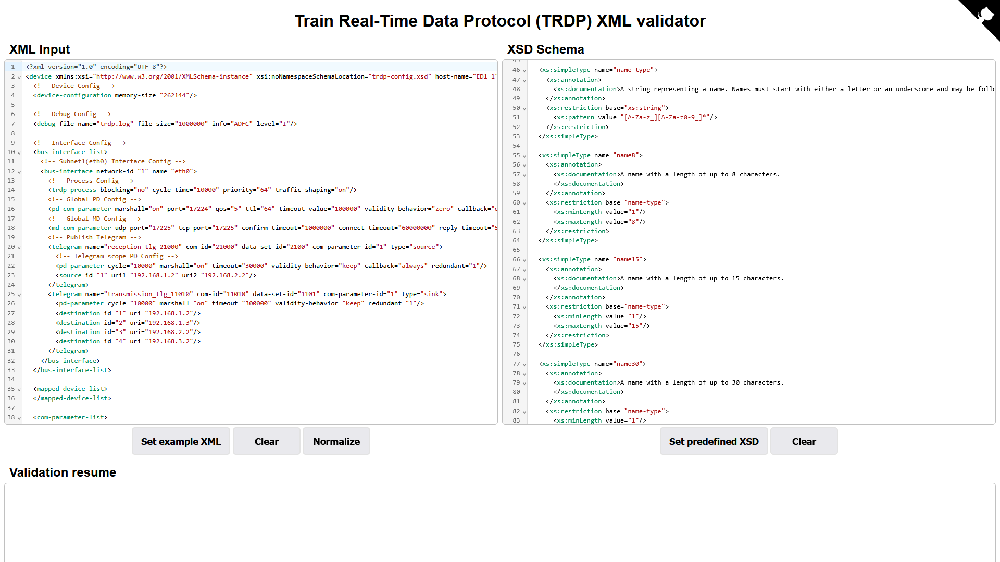

# TRDP XML Validator

TRDP XML Validator is a simple webapp tool, designed to validate XML files according to TRDP (Train Real-time Data Protocol, IEC61375-2-3) specifications.



## Use it offline

1. Clone or download this repository.

```shell
git clone git@github.com:ampuEus/trdp-xml-validator.git
```

1. Install project dependencies and devDependencies (I use pnpm as package manager)

```shell
pnpm i
```

3. Start local server (I use parcel)

```shell
pnpm dev
```

4. Go to `http://localhost:1234`

## Future Improvements / Help Needed

> [!NOTE]
> Contributions and ideas are welcome! Create an issue or pull request if you want to help.

- Create a desktop executable app for fully offline use.
